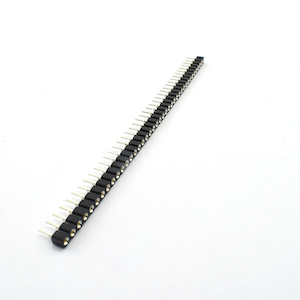
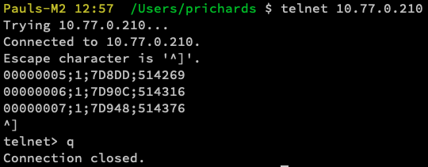
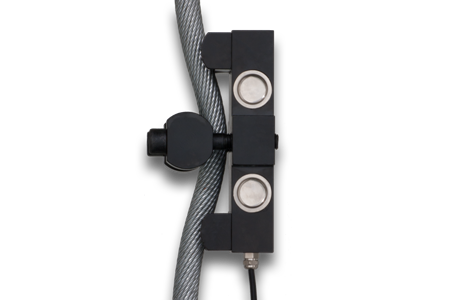

# Sole Digital Rope Clamp Load Cell sensor 
### An implementation using an Arduino Giga R1 
###### July 2025, Paul Richards, W. M. Keck Observatory

* * *

## Abstract

This document describes an implementation of a system for retrieving live data from a load cell.  

Primarily, this document is a guide to this specific project.  A secondary goal is to enumerate the capabilities of the components such that future projects can evaluate using this same architecture.

The values from a sensor are retrieved by an embedded system based on the Arduino Giga R1 with two attached shields: one for RS-485 communications, and one for Ethernet with power-over-ethernet capability.  

Load values are sent over the Keck network to a system running an EPICS IOC, which subsequently feeds it to the telemetry archiver that backs the Grafana data visualization system.  All combined, this allows a user to display the tension on a wire rope (such as the dome shutters) in real time alongside other aspects of control systems.  This is useful for adjustment and performance monitoring.

## Components

This design makes use of these parts.

1) Sole Digital DRC-10T Rope Clamp Load Cell <https://www.soledigital.com.au/rcxt.html>
1) Arduino GIGA R1 WiFi <https://store-usa.arduino.cc/products/giga-r1-wifi>
1) DFRobot Ethernet and PoE Shield <https://www.dfrobot.com/product-2370.html>
1) DFRobot RS485 Shield <https://www.dfrobot.com/product-1024.html>
1) USB thumb drive formatted for FAT32 (aka MS-DOS)
1) PoE injector or switch 
1) CAT-5e or -6 Ethernet cable
1) USB-C to PC interface cable
1) Arduino IDE with these libraries installed
  a) Arduino Mbed OS Giga Boards (board support package, also provides SPI library)
  b) Ethernet 
  c) ArduinoJson
  d) Arduino_USBHostMbed5
1) (optional) stacking headers to offset RS-485 shield height

Source code for this project is located at <https://github.com/KeckObservatory/arduino-giga-base> under the `giga-loadcell` directory.  This document also originates from that GitHub repository.

## Quickstart

1) Assemble the components above in a stack, with the RS-485 shield on top, Ethernet shield sandwiched in the middle, and the Arduino Giga at the bottom.

1) The RS-485 shield does not sit flush with the shield below it, due to the PC board length.  Depending on your needs, either trim the PC board to not collide with the RJ-45 connector, or add a row of headers (8 and 10 pin on one side, 6 and 8 pin on the other) to offset, such as these.

    

1) Download the source code repository from GitHub.

1) Copy the repository file `settings.json` to your USB thumb drive formatted for FAT32.

1) Modify the `settings.json` to have an appropriate MAC address and IP address for the subnet you plan to run it on.  The MAC address can be entirely random; it simply has to be different from every other device on your network.  See the section on SETTINGS below for details on this file.

1) Open the .ino file for the giga-loadcell in the Arduino IDE.

1) Install the libraries listed above.

1) Connect the Arduino Giga to the PC with a USB cable.

1) Compile the project.

1) Upload the project to the Arduino.

1) Insert the USB drive into the Arduino.

1) Press the reset (RST) button on the RS-485 shield.

1) The RGB light on the Giga will briefly flash blue when it loads the settings from the USB drive, then flash green at 1Hz.

1) Remove the USB power cable and the USB drive.

1) Connect the load cell to the RS-485 shield via the screw terminals or other connector.

1) Plug the Ethernet cable into the PoE source and into the Giga.

1) Verify the device is reporting values by connecting to it over the network.  For example, telnet to it and observe the results:
    

1) The device is now ready for your EPICS IOC to communicate with it.

## DRC-xT load cell sensor

A wire rope tension load cell is effectively an analog device that represents the force on the sensor as a resistance.  This resistance is converted into a numerical value by an on-board analog to digital converter, and then sent out a serial port (RS-485).

The protocol it implements is as follows, each packet sent immediately after the previous one, at 4800 baud.  Inspection of the serial stream indicates that the transmit time of one packet is 10.1ms, which is just under the threshold to yield an exact 100Hz signal.  (Running the feedback over the ethernet at 100Hz will be effective, however.)

| Byte | Value |
| ---- | ----- |
| 0    | always `0xAA` as a start-of-packet marker
| 1    | MSB of 24 bit signed integer value that represents the force on the load cell
| 2    | next byte of load value
| 3    | LSB of load value
| 4    | 8 bit unsigned integer checksum of the 3 previous bytes

Assemble the load value by placing the three individual bytes into the "front" of a 32 bit signed integer, then shifting right by 8 bits, in order to cause sign extension that preserves the sign of the value.  Such as:

`load = ((buffer[1] << 24) + (buffer[2] << 16) + (buffer[3] << 8)) >> 8;`

<u>Calibration</u>

[TBD]
The load cell must be calibrated to establish the relationship between the value measured and the actual tension on the cable.  The value from the device is unitless and must be converted to force by way of a calibration calculation.

More to come on this as a calibration method is determined.

## Arduino Giga R1 WiFi

The computing module has been selected for use in this project provides a number of desirable features 

<u>Shield Installation / Clearance</u>

Due to the SPI connection header, the Ethernet shield is the first one attached to the Arduino Giga.  The RS485 shield is installed on top of it.

## DFRobot RS485 Shield

## DFRobot Ethernet Shield

## Arduino firmware

<u>Power Over Ethernet</u>
<u>LED Heartbeat</u>
<u>USB Disk Configuration</u>

JSON format

## EPICS IOC

## EPICS Archiver Appliance

## Grafana
