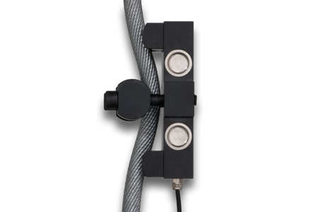

# Sole Digital Rope Clamp Load Cell sensor 
### An implementation using an Arduino GIGA R1 
###### July/August 2025, Paul Richards, W. M. Keck Observatory

* * *

## Abstract

This document describes an implementation of a system for retrieving live data from a load cell.  

Primarily, this document is a guide to this specific project.  A secondary goal is to enumerate the capabilities of the components such that future projects can evaluate using this same architecture.

The values from a sensor are retrieved by an embedded system based on the Arduino GIGA R1 with two attached shields: one for RS-485 communications, and one for Ethernet with power-over-ethernet capability.  

Load values are sent over the Keck network to a system running an EPICS IOC, which subsequently feeds it to the telemetry archiver that backs the Grafana data visualization system.  All combined, this allows a user to display the tension on a wire rope (such as the dome shutters) in real time alongside other aspects of control systems.  This is useful for adjustment and performance monitoring.

## Components

This design makes use of these parts.

1) Sole Digital DRC-10T Rope Clamp Load Cell <https://www.soledigital.com.au/rcxt.html>
1) Arduino GIGA R1 WiFi <https://store-usa.arduino.cc/products/giga-r1-wifi>
1) DFRobot Ethernet and PoE Shield <https://www.dfrobot.com/product-2370.html>
1) DFRobot RS485 Shield <https://www.dfrobot.com/product-1024.html>
1) USB flash drive formatted for FAT32 (aka MS-DOS), no larger than 32GB
1) PoE injector or switch 
1) CAT-5e or -6 Ethernet cable
1) USB-C to PC interface cable
1) Arduino IDE and associated libraries
1) (optional) stacking headers to offset RS-485 shield height

Source code for this project is located at <https://github.com/KeckObservatory/arduino-giga-base> under the `giga-loadcell` directory.  This document also originates from that GitHub repository.

## Development Environment

The Arudino IDE is used for building this project.  Install these libraries via the Library Manager.  As of August 2025, the ETL library must be updated manually to enable support for the `etl::unordered_map` feature.

  a) Arduino Mbed OS GIGA Boards (board support package, also provides SPI library)
  b) Ethernet 
  c) Arduino_USBHostMbed5
  d) [Embedded Template Library](https://www.etlcpp.com/) <span style="color: red;">v20.42.2</span> or later.  <i>Critically, this version is not the one that can be downloaded automatically in the Arduino IDE (as of August 2025 the version offered in the IDE is v20.40.0) and it must be updated by hand modifying your library installation.</i>

To install an up-to-date ETL library:

1) Install the latest version of "Embedded Template Library ETL by John Wellbelove" that the Arduino IDE will offer you.  If the version has since been updated to 20.42.2 or later in the Library Manager, stop here as there is nothing else to do.
1) Download the ZIP file of the latest ETL code from https://github.com/ETLCPP/etl/releases
1) Unzip the latest package to a temporary directory.
1) Open the directory that contains the source code for the old ETL.  On MacOS it is contained in `Documents/Arduino/libraries/Embedded_Template_Library_ETL`
1) Replace the file `Documents/.../Embedded_Template_Library_ETL/src/library.json` with `arduino/library-arduino.json` from the ZIP, but rename the file to remove the `-arduino` part.
1) Replace the file `Documents/.../Embedded_Template_Library_ETL/src/library.properties` with `arduino/library-arduino.properties` from the ZIP, but rename the file to remove the `-arduino` part.
1) Replace the file `Documents/.../Embedded_Template_Library_ETL/src/Embedded_Template_Library.h` with `arduino/Embedded_Template_Library.h` from the ZIP.
1) Replace the directory `Documents/.../Embedded_Template_Library_ETL/src/etl` with `arduino/include/etl` from the ZIP.

After you do this, the `giga-loadcell.ino` sketch should be able to compile in the Arduino IDE.

## Quickstart

1) Assemble the components above in a stack, with the RS-485 shield on top, Ethernet shield sandwiched in the middle, and the Arduino GIGA at the bottom.

1) The RS-485 shield does not sit flush with the shield below it, due to the PC board length.  Depending on your needs, either trim the PC board to not collide with the RJ-45 connector, or add a row of headers (8 and 10 pin on one side, 6 and 8 pin on the other) to offset, such as these.

    

1) Connect the load cell to the RS-485 shield via the screw terminals or other connector.

1) Install the Arduino IDE 2.x and the libraries listed above.

1) Download the source code repository from GitHub.  If unsure how to do this, download [GitHub Desktop](https://desktop.github.com/download/) and install it.  Connect it to your GitHub account and use it to clone this repository: https://github.com/KeckObservatory/arduino-giga-base

1) Connect the Arduino GIGA to the PC with the USB-C cable.

1) Copy the repository file `config.ini` to the root directory of your USB flash drive, formatted for FAT32.

1) Modify the `config.ini` to have an IP address (and netmask, etc) for the subnet you plan to run it on.  The MAC address will be generated in code based on the uniqe ID in the microprocessor.  See the section on SETTINGS below for details on this file.

1) Insert the USB drive into the Arduino.

1) Open the .ino file for the giga-loadcell in the Arduino IDE.

1) Compile the project.

1) Upload the project to the Arduino.  If the loading process seems to stall at the beginning, try double clicking the reset (RST) button on the GIGA or one of its shields.

1) Verify the messages in the Arduino IDE serial monitor display output like this, indicating that flash was formatted and the USB flash drive was detected and read.
    ```
    --------------------------------------------------------------------------------
    13:46:10.369 -> >>> Load cell device initialization start.
    13:46:10.369 -> >>> Built with C++ version: 201402
    13:46:10.369 -> >>> Init: storage.
    13:46:10.401 -> [STO] Flash registry is valid, test key tdb.initialized = 'format 1'
    13:46:10.401 -> >>> Init: registry.
    13:46:10.401 -> [CFG] Preloading registry with values from flash.
    13:46:10.401 -> [CFG]  TDBS = ''
    13:46:10.401 -> [CFG]  tdb.initialized = 'format 1'
    13:46:10.401 -> [CFG] Registry preload complete.
    13:46:10.667 -> [STO] Trying to connect to USB...
    13:46:10.765 -> [STO] Trying to connect to USB...
    13:46:10.864 -> [STO] Trying to connect to USB...
    13:46:10.962 -> [STO] Trying to connect to USB...
    13:46:11.129 -> [STO] Trying to connect to USB...
    13:46:11.228 -> [STO] Trying to connect to USB...
    13:46:11.423 -> [STO] USB mass storage device is present.
    13:46:13.167 -> [STO] USB mass storage device mounted.
    13:46:13.167 -> [STO] File /usb/config.ini found, 1037 bytes.
    13:46:13.167 -> [STO] File /usb/config.ini loaded.
    13:46:13.167 -> [CFG] Processing configuration file '/usb/config.ini' on USB flash drive.
    13:46:13.167 -> [CFG] Parsing configuration file.
    13:46:13.167 -> [CFG]   net.ip -> 10.77.0.210
    13:46:13.167 -> [CFG]   net.netmask -> 255.255.0.0
    13:46:13.167 -> [CFG]   net.gateway -> 10.77.0.1
    13:46:13.167 -> [CFG]   net.dns -> 128.171.1.1
    13:46:13.167 -> [CFG] Configuration file loaded.
    13:46:13.167 -> [CFG] Synchronizing registry with flash, total 5 keys.
    13:46:13.167 -> [CFG] Key net.dns not found in registry, creating it with '128.171.1.1'.
    13:46:13.167 -> [CFG] Key net.ip not found in registry, creating it with '10.77.0.210'.
    13:46:13.200 -> [CFG] Key net.gateway not found in registry, creating it with '10.77.0.1'.
    13:46:13.200 -> [CFG] Key tdb.initialized found in registry (format 1), no update required.
    13:46:13.200 -> [CFG] Key net.netmask not found in registry, creating it with '255.255.0.0'.
    13:46:13.200 -> [CFG] Registry load complete.
    13:46:13.200 -> >>> Init: ethernet.
    13:46:13.200 -> [ETH] Configuring IP address 10.77.0.210 (netmask 255.255.0.0, gateway 10.77.0.1, dns 128.171.1.1)
    13:46:13.763 -> [ETH] Starting TCP/IP server.
    13:46:13.763 -> >>> Init: load cell.
    13:46:13.763 -> >>> Initialization complete.
    ```

1) Disconnect the USB interface cable from the Arduino.

1) Plug the Ethernet cable into the PoE source and into the GIGA.

1) Press the reset (RST) button on the RS-485 shield.

1) Verify the device is reporting values by connecting to it over the network.  For example, telnet to it and observe the results:
    

1) The device is now ready for your EPICS IOC to communicate with it.


## DRC-xT load cell sensor

A wire rope tension load cell is effectively an analog device that represents the force on the sensor as a resistance.  This resistance is converted into a numerical value by an on-board analog to digital converter, encoded and then sent out a serial port (RS-485).



The protocol it implements is as follows, each packet sent immediately after the previous one, at 4800 baud.  Inspection of the serial stream indicates that the transmit time of one packet is 10.1ms, which is just under the threshold to yield an exact 100Hz signal.  (Running the feedback over the ethernet at 100Hz will be effective, however.)

| Byte | Value |
| ---- | ----- |
| 0    | always `0xAA` as a start-of-packet marker
| 1    | MSB of 24 bit signed integer value that represents the force on the load cell
| 2    | next byte of load value
| 3    | LSB of load value
| 4    | 8 bit unsigned integer checksum of the 3 previous bytes

Assemble the load value by placing the three individual bytes into the "front" of a 32 bit signed integer, then shifting right by 8 bits, in order to cause sign extension that preserves the sign of the value.  Such as:

`load = ((buffer[1] << 24) + (buffer[2] << 16) + (buffer[3] << 8)) >> 8;`

<u>Calibration [THIS SECTION IS TBD]</u>

The load cell must be calibrated to establish the relationship between the value measured and the actual tension on the cable.  The value from the device is unitless and must be converted to force by way of a calibration calculation.

It is initially assumed that each load cell requires a set of unique calibration coefficients that are stored on the device in the registry.  They are initially loaded onto the device using the `config.ini` file in a field named `cal.tbd_tbd_tbd`.

More to come on this as a calibration method is determined.

## Arduino GIGA R1 WiFi

The computing module that has been selected for use in this project provides a number of desirable features for other projects that need an embedded system.
* 76 digital I/O pins
* 12 analog input pins, 16 bit resolution
* 4 UART
* 3 I2C
* 2 SPI
* 480MHz clock speed
* 2MB program flash
* 16MB external flash (requires MBED library to use, see `giga-loadcell/giga-storage.cpp` in this repository)
* 1MB SRAM
* 8MB SDRAM (requires SDRAM library to use)
* JTAG with an STLink-V3

More features than listed above are [detailed here](https://docs.arduino.cc/tutorials/giga-r1-wifi/cheat-sheet/).

<u>Shield Installation / Clearance</u>

Due to the SPI connection header, the Ethernet shield is the first one attached to the Arduino GIGA.  The RS485 shield is installed on top of it.

## DFRobot RS485 Shield

This shield from DFRobot (https://www.dfrobot.com/product-1024.html) was chosen for the simplicity of using the built-in Arduino UART as an RS-485 port.  No special code is needed.  The serial port is instantiated as `Serial1` in the Arduino code.

## DFRobot Power-Over-Ethernet Shield

This shield from DFRobot (https://www.dfrobot.com/product-2370.html) was chosen for the power-over-ethernet capabilities that work without needing any special code other than the default Arduino Ethernet library.

## Arduino firmware 

<u>Power Over Ethernet</u>

PoE 

<u>LED Heartbeat</u>

To address the 3 color LED, see an implementation in `giga-loadcell/giga-led.cpp` in this repository. 

<u>USB Disk Configuration</u>


## EPICS IOC

The EPICS IOC implementation relies on 

## EPICS Archiver Appliance

## Grafana


## Expansion Notes

<u>On Board Flash</U>
In the source code `giga-loadcell/giga-storage.cpp`, it checks to see if there is a valid KVStore in partition 1 and ensures that a certain key is present.  That key/value store occupies the first 1MB of the 16MB flash device soldered to the GIGA R1 board.  This provides plenty of room for expansion to store other types of data.  

The Arduino library provides an example sketch that is used interactively to format the device for use with WiFi and to create a USB mountable user partition.  In the Arduino IDE, inspect the example sketch that is loaded with "File > Examples > STM32H747_System > QSPIFormat".  This is a good example of making other partition types.