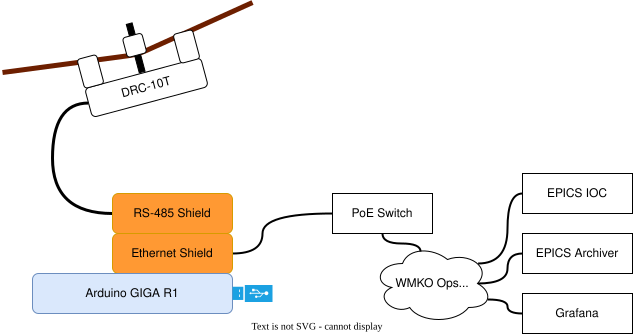
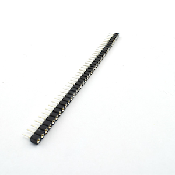
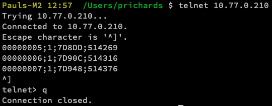

# Sole Digital Rope Clamp Load Cell sensor 
### An implementation using an Arduino GIGA R1 
###### July/August 2025, Paul Richards, W. M. Keck Observatory

* * *

## Abstract

This document describes the implementation of a system for retrieving live data from a load cell.  

Instructions for calibration, deployment, and maintenance are covered separately [in another document](Load_Cell_Installation_Procedures.md).

Primarily, this is a guide to this specific project.  A secondary goal is to enumerate the capabilities of the components such that future projects can evaluate using this same architecture.

## Components and Principle of Operation

Pictured below are the components integral to the complete solution.  

<div style="text-align: center;">


</div>

This design is composed of:

1) Sole Digital DRC-10T Rope Clamp Load Cell <https://www.soledigital.com.au/rcxt.html>
1) Arduino GIGA R1 WiFi <https://store-usa.arduino.cc/products/giga-r1-wifi>
1) DFRobot Ethernet and PoE Shield <https://www.dfrobot.com/product-2370.html>
1) DFRobot RS485 Shield <https://www.dfrobot.com/product-1024.html>
1) (optional) stacking headers to offset RS-485 shield height
1) USB flash drive formatted for FAT32 (aka MS-DOS), no larger than 32GB
1) PoE injector or switch 
1) CAT-5e or -6 Ethernet cable
1) A new EPICS IOC 
1) The existing EPICS Archiver appliance
1) The existing Grafana system

Development and initial installation requires additional components:

1) USB-C to PC interface cable
1) Arduino IDE and associated libraries

The values from the sensor are sent via the RS-485 serial interface into the combined shields and Arduino stack.  Power and Keck ops network communications is provided by the PoE switch.  An EPICS IOC running in the ops network connects to the Arduino stack via TCP/IP and receives the sensor values, which are then represented as EPICS channels.  The EPICS Archiver connects to these EPICS channels and continuously records them to storage.  The Grafana visualization system retrieves the archived data from the Archiver and renders it as time series graphs for the user.

All combined, this allows a user to display the tension on a wire rope (such as those on the dome shutters) in real time alongside other aspects of control systems.  This is useful for adjustment and performance monitoring.

## Development Environment

Source code for this project is located at <https://github.com/KeckObservatory/arduino-giga-base> under the `giga-loadcell` directory.  This document also originates from that GitHub repository.

The Arudino IDE 2.x is used for building this project.  Install these libraries via the Library Manager.  As of August 2025, the ETL library must be updated manually to enable support for the `etl::unordered_map` feature.

  a) Arduino Mbed OS GIGA Boards (board support package, also provides SPI library)
  b) Ethernet 
  c) Arduino_USBHostMbed5
  d) [Embedded Template Library](https://www.etlcpp.com/) <span style="color: red;">v20.42.2</span> or later.  <i>Critically, this version is not the one that can be downloaded automatically in the Arduino IDE (as of August 2025 the version offered in the IDE is v20.40.0) and it must be updated by hand modifying your library installation.</i>

To install an up-to-date ETL library:

1) Install the latest version of "Embedded Template Library ETL by John Wellbelove" that the Arduino IDE will offer you.  If the version has since been updated to 20.42.2 or later in the Library Manager, stop here as there is nothing else to do.
1) Download the ZIP file of the latest ETL code from https://github.com/ETLCPP/etl/releases
1) Unzip the latest package to a temporary directory.
1) Open the directory that contains the source code for the old ETL.  On MacOS it is contained in `Documents/Arduino/libraries/Embedded_Template_Library_ETL`
1) Replace the file `Documents/.../Embedded_Template_Library_ETL/src/library.json` with `arduino/library-arduino.json` from the ZIP, but rename the file to remove the `-arduino` part.
1) Replace the file `Documents/.../Embedded_Template_Library_ETL/src/library.properties` with `arduino/library-arduino.properties` from the ZIP, but rename the file to remove the `-arduino` part.
1) Replace the file `Documents/.../Embedded_Template_Library_ETL/src/Embedded_Template_Library.h` with `arduino/Embedded_Template_Library.h` from the ZIP.
1) Replace the directory `Documents/.../Embedded_Template_Library_ETL/src/etl` with `arduino/include/etl` from the ZIP.

After you do this, the `giga-loadcell.ino` sketch should be able to compile in the Arduino IDE.

## Developer Quickstart

For the purposes of developing software to run on this hardware stack, these instructions will get you started.  

1) Assemble the components above in a stack, with the RS-485 shield on top, Ethernet shield sandwiched in the middle, and the Arduino GIGA at the bottom.

1) The RS-485 shield does not sit flush with the shield below it, due to the PC board length.  Depending on your needs, either trim the PC board to not collide with the RJ-45 connector, or add a row of headers (8 and 10 pin on one side, 6 and 8 pin on the other) to offset, such as these.

    

1) Connect the load cell to the RS-485 shield via the screw terminals or other connector.

1) Install the Arduino IDE 2.x and the libraries listed above.

1) Download the source code repository from GitHub.  If unsure how to do this, download [GitHub Desktop](https://desktop.github.com/download/) and install it.  Connect it to your Keck GitHub account and use it to clone this repository: https://github.com/KeckObservatory/arduino-giga-base

1) Copy the repository file `config.ini` to the root directory of your USB flash drive, formatted for FAT32.

1) Modify the `config.ini` to have an IP address (and netmask, etc) for the subnet you plan to run it on.  The MAC address will be generated in code based on the uniqe ID in the microprocessor.  See the section on settings below for details on this file.

1) Insert the USB drive into the Arduino.

1) Open the .ino file for the giga-loadcell in the Arduino IDE.

1) Compile the project.

1) Connect the Arduino GIGA to the PC with the USB-C cable.

1) Upload the project to the Arduino.  If the loading process seems to stall at the beginning, try double clicking the reset (RST) button on the GIGA or one of its shields.

1) Verify the messages in the Arduino IDE serial monitor display output like this, indicating that flash was formatted and the USB flash drive was detected and read.
    ```
    --------------------------------------------------------------------------------
    13:46:10.369 -> >>> Load cell device initialization start.
    13:46:10.369 -> >>> Built with C++ version: 201402
    13:46:10.369 -> >>> Init: storage.
    13:46:10.401 -> [STO] Flash registry is valid, test key tdb.initialized = 'format 1'
    13:46:10.401 -> >>> Init: registry.
    13:46:10.401 -> [CFG] Preloading registry with values from flash.
    13:46:10.401 -> [CFG]  TDBS = ''
    13:46:10.401 -> [CFG]  tdb.initialized = 'format 1'
    13:46:10.401 -> [CFG] Registry preload complete.
    13:46:10.667 -> [STO] Trying to connect to USB...
    13:46:10.765 -> [STO] Trying to connect to USB...
    13:46:10.864 -> [STO] Trying to connect to USB...
    13:46:10.962 -> [STO] Trying to connect to USB...
    13:46:11.129 -> [STO] Trying to connect to USB...
    13:46:11.228 -> [STO] Trying to connect to USB...
    13:46:11.423 -> [STO] USB mass storage device is present.
    13:46:13.167 -> [STO] USB mass storage device mounted.
    13:46:13.167 -> [STO] File /usb/config.ini found, 1037 bytes.
    13:46:13.167 -> [STO] File /usb/config.ini loaded.
    13:46:13.167 -> [CFG] Processing configuration file '/usb/config.ini' on USB flash drive.
    13:46:13.167 -> [CFG] Parsing configuration file.
    13:46:13.167 -> [CFG]   net.ip -> 10.77.0.210
    13:46:13.167 -> [CFG]   net.netmask -> 255.255.0.0
    13:46:13.167 -> [CFG]   net.gateway -> 10.77.0.1
    13:46:13.167 -> [CFG]   net.dns -> 128.171.1.1
    13:46:13.167 -> [CFG] Configuration file loaded.
    13:46:13.167 -> [CFG] Synchronizing registry with flash, total 5 keys.
    13:46:13.167 -> [CFG] Key net.dns not found in registry, creating it with '128.171.1.1'.
    13:46:13.167 -> [CFG] Key net.ip not found in registry, creating it with '10.77.0.210'.
    13:46:13.200 -> [CFG] Key net.gateway not found in registry, creating it with '10.77.0.1'.
    13:46:13.200 -> [CFG] Key tdb.initialized found in registry (format 1), no update required.
    13:46:13.200 -> [CFG] Key net.netmask not found in registry, creating it with '255.255.0.0'.
    13:46:13.200 -> [CFG] Registry load complete.
    13:46:13.200 -> >>> Init: ethernet.
    13:46:13.200 -> [ETH] Configuring IP address 10.77.0.210 (netmask 255.255.0.0, gateway 10.77.0.1, dns 128.171.1.1)
    13:46:13.763 -> [ETH] Starting TCP/IP server.
    13:46:13.763 -> >>> Init: load cell.
    13:46:13.763 -> >>> Initialization complete.
    ```

1) Disconnect the USB interface cable from the Arduino.

1) Plug the Ethernet cable into the PoE source and into the GIGA.

1) Press the reset (RST) button on the RS-485 shield.

1) Verify the device is reporting values by connecting to it over the network.  For example, telnet to it and observe the results:
    

1) The device is now ready for the EPICS IOC to communicate with it.

## DRC-xT load cell sensor

A wire rope tension load cell is effectively an analog device that represents the force on the sensor as a resistance.  This resistance is converted into a numerical value by an on-board analog to digital converter, encoded and then sent out a serial port (RS-485).


The protocol it implements is as follows, each packet sent immediately after the previous one, at 4800 baud.  Inspection of the serial stream indicates that the transmit time of one packet is 10.1ms, which is just under the threshold to yield an exact 100Hz signal.  (Running the feedback over the ethernet at 100Hz will be effective, however.)

| Byte | Value |
| ---- | ----- |
| 0    | always `0xAA` as a start-of-packet marker
| 1    | MSB of 24 bit signed integer value that represents the force on the load cell
| 2    | next byte of load value
| 3    | LSB of load value
| 4    | 8 bit unsigned integer checksum of the 3 previous bytes

Assemble the load value by placing the three individual bytes into the "front" of a 32 bit signed integer, then shifting right by 8 bits, in order to cause sign extension that preserves the sign of the value.  Such as:

`load = ((buffer[1] << 24) + (buffer[2] << 16) + (buffer[3] << 8)) >> 8;`

#### Calibration [THIS SECTION IS TBD]

The load cell must be calibrated to establish the relationship between the value measured and the actual tension on the cable.  The value from the device is unitless and must be converted to force by way of a calibration calculation.

It is initially assumed that each load cell requires a set of unique calibration coefficients that are stored on the device in the registry.  They are initially loaded onto the device using the `config.ini` file in a field named `cal.tbd_tbd_tbd`.

More to come on this as a calibration method is determined.

## DFRobot RS485 Shield

This shield from DFRobot (https://www.dfrobot.com/product-1024.html) was chosen for the simplicity of using the built-in Arduino UART as an RS-485 port.  No special code is needed.  The serial port is referenced as `Serial1` in the Arduino code.

## DFRobot Power-Over-Ethernet Shield

This shield from DFRobot (https://www.dfrobot.com/product-2370.html) was chosen for the power-over-ethernet capabilities that work without needing any special code other than the default Arduino Ethernet library.  Use of PoE gives us two advantages: ability to power cycle the device using only software that controls the network switch, and eliminates a need for a separate power connection to each Arduino when multiple are installed together in a cabinet.

Due to the SPI connection header, the Ethernet shield is the first one attached to the Arduino GIGA.  The RS485 shield must be installed on top of it.

## Arduino GIGA R1 WiFi 

This device was chosen primarily due to its flexibility to fill many embedded system roles at Keck.  Selection criteria included a desire to use a development framework that was widely adopted by both professionals and hobbyists, and to provide the widest appeal to the engineering staff at Keck; this led us to select the combination of the Arduino platform with a popular board designed with an STM32 ARM microprocessor.  Furthermore we wanted JTAG debug ability, now that the Arduino 2.x IDE support probes for live debugging.

For this load cell project we implemented libraries in C++ for multiple subsystems.

USB Mass Storage Devices (giga-storage.cpp)
: The USB 2.0 Type A port is capable of running in host mode.  This allows us to use a USB flash disk with a filesystem on it to provide a means to configure the Arduino without having to statically embed settings (such as an IP address) in the firmware itself.  The [ARM MBED OS 5](https://os.mbed.com/docs/mbed-os/v5.15/introduction/index.html) library fully supports the GIGA R1 board and provides convenient APIs for accessing mass storage devices.  It would be very straightforward to further use this API to write the recorded load cell values to a large flash drive, eliminating the dependence on ethernet.

On-board Flash (giga-config.cpp)
: The GIGA R1 has 16MB of flash storage available for use.  Typically, this is used to store a driver for the WiFi (which we do not use) and thus can be reformatted for own use.  In this project we allocate 1MB of this flash for a key/value data store that is used to permanently save the settings from an INI file.  The flash drive can be removed and the settings will be read at startup.

RGB LED (giga-led.cpp)
: The GIGA R1 puts 3 separate LEDs on GPIO lines.  We can then use them to give the user feedback on the state of the device without needing a USB serial connection to a PC.  Flashing green at 1Hz indicates it is running normally.  Rapid flashing red indicates a failure mode that must be investigated with a serial terminal.

Ethernet (giga-ethernet.cpp)
: The default Arduino Ethernet library is adequate for this project.  Notably, the developer is obligated to provide a MAC address for the WizNet W5500 chip on the shield.  Rather than require someone to generate a series of addresses we have chosen to convert the unique microprocessor serial number into the last 3 bytes of the MAC.  The first three are WizNet's organizationally unique ID (OUI) `00:08:DC` found [here](https://standards-oui.ieee.org/).

## Settings in config.ini 

It is required that the network configuration values be set in the device by providing them on a USB flash drive.  Inside the `config.ini` file (an example of which is provided in the GitHub repository) you must set the correct values for each particular installation of a sensor and Arduino stack.  The software observes the typical .ini format, but does not require section naming such as `[network]`, and it will be safely ignored.

The firmware on the Arduino will retrieve these values from the `config.ini` file and store them in the flash automatically.

```
net.ip = 10.77.0.210
net.netmask = 255.255.0.0
net.gateway = 10.77.0.1
net.dns = 128.171.1.1
```

It is anticipated that a calibration design shall emerge once we obtain a number of the load cells and use them with various actual cable loads.  If/when it is determined that the load cells must carry with them calibration values, they will be stored here in the config file, such as this:

```
cal.coeff1 = 1.0
cal.coeff2 = 2.0
cal.coeff3 = 3.0
```

Given the potentially large number of devices that may be deployed simultaneously at summit, we need a means to reduce confusion on which device has been configured with which `config.ini` (as they are supposed to have unique net.ip fields).  This would allow one USB flash drive to be used with all the devices at once.  

When a device boots it emits its processor's 96 bit unique ID:

`>>> Processor UID = 35353335-12513332-44002F00`

We can use this ID as a filename.  Hypothetically we can modify the code in `giga-config.cpp` to try loading the UID as the filename first, before defaulting to the basic `config.ini` file.

## Troubleshooting

In general, troubleshooting issues with the system will require connecting a laptop to the USB-C port and using a terminal emulator to see the diagnostic text is printed at boot time. 

On Windows, `putty` is a great tool for serial port communication.  Download it [here](https://www.chiark.greenend.org.uk/~sgtatham/putty/latest.html).  Get the simpler `putty.exe` binary if you do not have administrator access to your system.

On MacOS, the terminal emulator `screen` is built in.  To use it, determine which tty belongs to the Arduino.

```
$ ls -lrt /dev/cu.*
crw-rw-rw-  1 root  wheel  0x9000001 Jul 21 09:06 /dev/cu.debug-console
crw-rw-rw-  1 root  wheel  0x9000003 Jul 21 09:06 /dev/cu.Bluetooth-Incoming-Port
crw-rw-rw-  1 root  wheel  0x9000007 Aug 20 15:37 /dev/cu.usbmodem112401
```

Press the reset button on the Arduino and connect to it with `screen`.  You will need to have the command typed and ready to press ENTER right after you hit the reset button.

```
screen /dev/cu.usbmodem112401
```

Either reset the device again or press Control-A-K to kill the screen session.

Example problem: missing values in `config.ini`
: The contents of the INI file must have the network values listed above, or the system cannot function.  When this condition is detected the Arduino Giga code will flash the LED red in a rapid pattern.  Text such as this is sent to the terminal.  

    ```
    13:45:51.098 -> [CFG] MISSING REGISTRY ENTRY: net.ip not present in registry!
    13:45:51.098 -> [CFG] MISSING REGISTRY ENTRY: net.netmask not present in registry!
    13:45:51.098 -> [CFG] MISSING REGISTRY ENTRY: net.gateway not present in registry!
    13:45:51.098 -> [CFG] MISSING REGISTRY ENTRY: net.dns not present in registry!
    13:45:51.098 -> ***** INCOMPLETE REGISTRY - 4 KEY(S) MISSING! *****
    13:45:51.098 -> >>> HALTING FOR FAILURE <<<
    ```

: To correct the problem, fix the indicated values in the config file and power cycle the Arduino.

## EPICS Interface

The EPICS IOC implementation relies on the Keck SerialStream library and thus must be built and deployed from a kroot.  It also needs the [Python EPICS softIOC](https://pypi.org/project/softioc/) library.  The IOC code provided in this repository cannot run without a kroot and it is up to the reader to understand how to deploy this to a server in the Keck ops network.

Once the IOC is deployed and running, change the EPICS gateway configuration to include it in the list of services. 

## Expansion Notes

In this section is discussion about how to expand the usage of various Arduino or Giga subsystems.

<u>Arduino GIGA</U>
The computing module that has been selected for use in this project provides a number of desirable features for other projects that need an embedded system.
* 76 digital I/O pins
* 12 analog input pins, 16 bit resolution
* 4 UART
* 3 I2C
* 2 SPI
* 480MHz clock speed
* 2MB program flash
* 16MB external flash
* 1MB SRAM
* 8MB SDRAM (requires SDRAM library to use)
* JTAG with an STLink-V3

More features than listed above are [detailed here](https://docs.arduino.cc/tutorials/giga-r1-wifi/cheat-sheet/).

<u>On Board Flash</U>
In the source code `giga-loadcell/giga-storage.cpp`, it checks to see if there is a valid KVStore in partition 1 and ensures that a certain key is present.  That key/value store occupies the first 1MB of the 16MB flash device soldered to the GIGA R1 board.  This provides plenty of room for expansion to store other types of data.  

<u>WiFi</U>
The Arduino library provides an example sketch that is used interactively to format the device for use with WiFi and to create a USB mountable user partition.  In the Arduino IDE, inspect the example sketch that is loaded with "File > Examples > STM32H747_System > QSPIFormat".  This is a good example of making other partition types.
